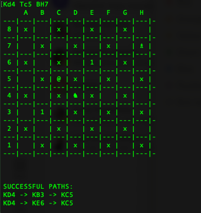

# chess-knight-short-path
The application calculates a list of all possible paths that one knight piece in the starting position could take to reach the ending position in 3 moves.

### Task
Create a Java application that should represent an empty chessboard where the user will be able to enter a starting position and an ending position. The application should then calculate a list of all possible paths that one knight piece in the starting position could take to reach the ending position in 3 moves. Some inputs might not have a solution, in this case the program should display a message that no solution has been found. Otherwise, the shortest path (if that exists) should be returned.

Please note:
- Although a graphical display would be welcome, this is not required.
- Input can be given by the command line, a text file or whatever you might prefer.
- Output could also be kept simple: just print out the path in a textual format (i.e. A2 -> B5 etc)
- Emphasis will be given on the algorithm, general code structure and how the program could be extended.
- Unit tests would be highly appreciated

### How to build the program
-  mvn package

### How to start the program
- cd target
- java -cp chess-khnight-short-path-1.0.1.jar com.chess.Main

### Test input
Kd4 Tc5 BH7

All transit steps are market with numbers.

### Pieces
* K - (♞)Knight
* B - (♗)Bishop
* T - (@)Target

### How to quit the program
Input command: 
- quit

### Summary
- The code contains some FIXME comments and Suppressed annotations because of lack of time. These parts of the system can be improved in case with additional time.
- For next version I'd propose to implement Dijkstra's algorithm for finding the shortest paths.
- Additionally, it would be correct to cover all system with test coverage more than expected level.
- If the system grows it would be good to apply some DI approach with possibility to inject mocks as Mockito. 

